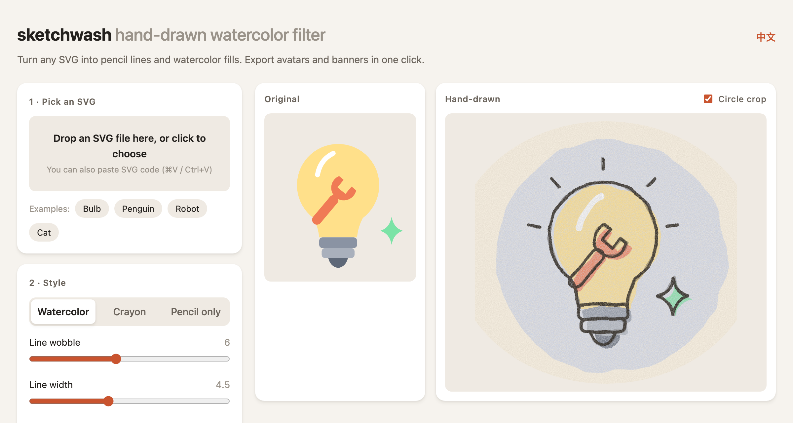

# sketchwash

Turn any SVG into a **hand-drawn watercolor sketch**: wobbly pencil lines, watercolor fills with slight misregistration, and paper grain. Export avatars and banners for social media in one click.

**Try it →** https://idea2tool.github.io/sketchwash/

[中文说明](#中文说明)



## Features

- Drop, pick or paste an SVG
- Three styles: watercolor, crayon, pencil only
- Adjust line wobble, line width, color offset, paper grain, padding and colors
- "New strokes": same settings, a fresh set of random strokes
- Export PNG (avatar 400×400, banner 1500×500, any width) or SVG
- One HTML file, no dependencies, nothing to install
- English and Chinese UI (switches automatically, or use `?lang=en` / `?lang=zh`)

## How is it different?

[svg2roughjs](https://github.com/fskpf/svg2roughjs) redraws every shape with Rough.js and gives a whiteboard-sketch look. sketchwash does not redraw shapes. It runs the original SVG through SVG filters (`feTurbulence` + `feDisplacementMap`) for a picture-book watercolor look, so gradients, text and complex paths are kept.

## Privacy and security

- **Runs entirely in your browser.** Nothing is uploaded.
- **SVG only, no photos, by design**, so the tool cannot be used on photos of real people. Embedded raster images are stripped.
- Imported SVGs are sanitized with an **allowlist**: only safe SVG elements and style properties are kept, links must be local (`#id`), stylesheets are parsed by the browser and re-applied as safe inline styles, and escapes or external resources are removed.
- File size, element count and `<use>` nesting are limited, so a malicious file cannot freeze the browser.
- Previews are shown with ``, so code inside an SVG never runs.

## Acceptable use

Please do not use it for illegal, obscene, infringing or impersonating content. You are responsible for the SVGs you use and the images you export.

## Optional hints in your SVG

Add a `data-sw` attribute to an element to control how it is drawn:

| Attribute | Effect | Good for |
|---|---|---|
| `data-sw="ink"` | Keep its original color, no pencil outline | Eye highlights, small text |
| `data-sw="soft"` | No pencil outline | Blush, highlights |

Without hints, small dark solid shapes are treated as ink automatically.

## Run locally

Open `index.html` in a browser. If your browser blocks local files, run:

```bash
python3 -m http.server 5173
```

Then open http://127.0.0.1:5173/

Made with AI by [@idea2tool](https://github.com/idea2tool). MIT License.

---

## 中文说明

把 SVG 变成**铅笔线条 + 水彩上色**的手绘风格，直接导出 X / 社交媒体的头像和横幅。

**在线使用 →** https://idea2tool.github.io/sketchwash/?lang=zh


- 拖入、选择或直接粘贴 SVG；三种画风：水彩、蜡笔、铅笔线稿
- 可调：线条抖动、线条粗细、颜色错位、纸张纹理、留白、颜色；「换一种笔触」换一组随机笔触
- 导出 PNG（头像 400×400、横幅 1500×500、任意宽度）和 SVG
- 单个 HTML 文件，没有依赖，不需要安装；中英文界面自动切换

**和其他工具的区别**：svg2roughjs 把图形重新画一遍，是白板草图风；sketchwash 用 SVG 滤镜处理原图，是水彩绘本风，渐变、文字和复杂路径都会保留。

**隐私和安全**：全部在浏览器里运行，文件不会上传。只支持 SVG 矢量图，不支持照片，这是有意的设计，避免被用来处理真人照片。导入时用白名单清理，脚本、外部资源和内嵌位图都会被删除。

**使用须知**：请勿用于违法、低俗、侵权或冒充他人的内容。你使用的 SVG 和导出的图片，版权和责任归你自己。

**可选提示**：元素上加 `data-sw="ink"` 保持原色、不描铅笔轮廓（适合眼睛高光、小字）；加 `data-sw="soft"` 不描铅笔轮廓（适合腮红、高光）。
