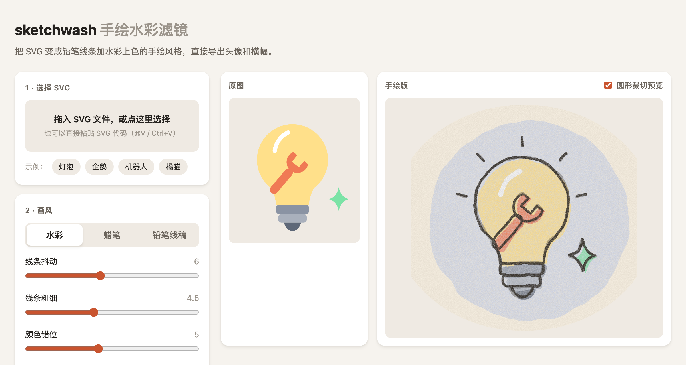

# sketchwash · 手绘水彩滤镜

把 SVG 变成**铅笔线条 + 水彩上色**的手绘风格，直接导出 X / 社交媒体的头像和横幅。

**在线使用 →** https://idea2tool.github.io/sketchwash/



## 功能

- 拖入、选择或直接粘贴 SVG
- 三种画风：水彩、蜡笔、铅笔线稿
- 可调：线条抖动、线条粗细、颜色错位、纸张纹理、留白、颜色
- 「换一种笔触」：同样的参数，换一组随机笔触
- 导出 PNG（头像 400×400、横幅 1500×500、任意宽度）和 SVG
- 单个 HTML 文件，没有依赖，不需要安装

## 和其他工具有什么不同

[svg2roughjs](https://github.com/fskpf/svg2roughjs) 用 Rough.js 把图形重新画一遍，效果是白板草图风。sketchwash 不重画图形，而是用 SVG 滤镜（`feTurbulence` + `feDisplacementMap`）处理原图，效果是水彩绘本风，渐变、文字和复杂路径都会保留。

## 隐私和安全

- **全部在浏览器里运行**，文件不会上传到任何地方
- **只支持 SVG 矢量图，不支持照片**。这是有意的设计：避免被用来处理真人照片。SVG 里内嵌的位图会被移除
- 导入时用**白名单**清理：只保留 SVG 的图形、渐变、遮罩等安全元素；链接只允许页内引用（`#id`）；`<style>` 由浏览器解析后只保留安全的样式属性，转义写法和外部资源一律删除
- 限制文件大小、元素数量和 `<use>` 嵌套，防止恶意文件卡死浏览器
- 预览用 `` 显示，浏览器不会运行图片里的代码

## 使用须知

请勿用于违法、低俗、侵权或冒充他人的内容。你上传的 SVG 和导出的图片，版权和责任归你自己。

## 可选：给 SVG 加提示

在元素上加 `data-sw` 属性，可以控制它的画法：

| 属性 | 效果 | 适合 |
|---|---|---|
| `data-sw="ink"` | 保持原色，不改成铅笔描边 | 眼睛高光、小字 |
| `data-sw="soft"` | 不画铅笔轮廓 | 腮红、高光 |

不加也可以：又小又深的实心图形会自动当作「墨迹」处理。

## 本地运行

直接用浏览器打开 `index.html` 即可。如果浏览器限制本地文件，可以运行：

```bash
python3 -m http.server 5173
```

然后打开 http://127.0.0.1:5173/

---

## English

**sketchwash** turns any SVG into a hand-drawn look: wobbly pencil lines, watercolor fills with slight misregistration, and paper grain. Export PNG avatars (400×400) and banners (1500×500) for social media.

- Runs entirely in your browser. Nothing is uploaded.
- SVG only, no photos, by design. Embedded raster images are stripped.
- Imported SVGs are sanitized with an allowlist: only safe SVG elements and style properties are kept, links must be local (`#id`), stylesheets are parsed by the browser and re-applied as safe inline styles, and size / node / `<use>` nesting limits apply.
- Please do not use it for illegal, obscene, infringing or impersonating content.

Made with AI by [@idea2tool](https://github.com/idea2tool). MIT License.
